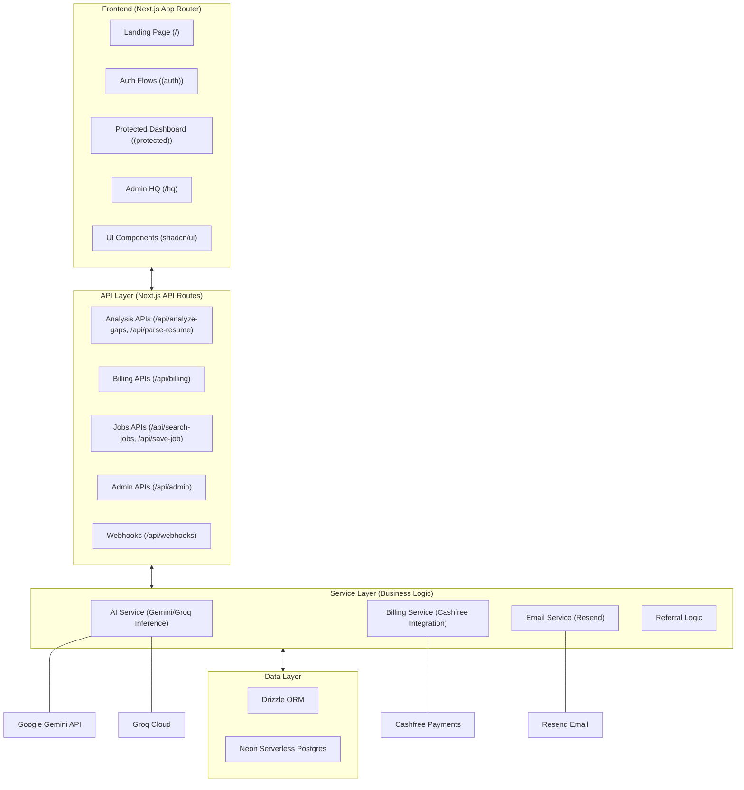
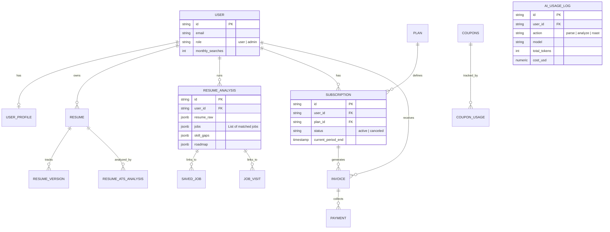

# Architecture Guidelines

This project is a web application, not a static marketing site. To maintain a clean separation of concerns and ensure a robust application architecture, the following rules must be followed for all new features and refactors.

## 1. Separation of Frontend and Backend
We maintain a strict separation between the frontend UI and the backend logic. 

- **Frontend**: Primarily client-side components (`"use client"`) that interact with the backend via standard HTTP requests.
- **Backend**: API routes and server-side services that handle data processing, database interactions, and business logic.

## 2. API Routes over Server Actions
While Next.js supports Server Actions and React Server Components (RSC) for data fetching/mutations, we prefer a traditional API-driven approach for this application.

- **Mandatory**: Use API routes (`src/app/api/...`) for:
    - Data fetching (GET requests).
    - Form submissions and data mutations (POST, PUT, DELETE requests).
    - Complex business logic.
- **Discouraged**: 
    - Do not use Server Actions (`"use server"`) for primary application features.
    - Avoid performing heavy data fetching directly inside Server Components if they can be moved to a client component with an API call.

## 3. Client-Side Data Fetching
Use standard patterns for client-side data fetching (e.g., `useEffect` with `fetch`, or libraries like SWR/React Query if available).

- Fetch data from `/api/...` endpoints.
- Manage loading and error states in the client component.
- Use optimistic updates in the UI where appropriate.

## 4. When to use Server Components
Server Components should be used sparingly, primarily for:
- Initial page metadata (SEO).
- Layout structures that don't require high interactivity.
- Passing initial context/props to the root client components of a page.

## 5. Security and Validation
All backend logic must be implemented in API routes where:
- Authentication is strictly verified (using `auth.api.getSession`).
- Input validation is performed before any database operation.
- Rate limiting and other security measures are applied.

---
**Note to LLM**: When creating or modifying features, always refer to this document. If a task involves data mutation, create a corresponding API route instead of a Server Action.
---

## 6. System Visualization

This section provides a visual mapping of the project's structure and data flow to help agents understand the system at a glance.

### 6.1. High-Level System Architecture

### 6.2. Database Entity Relationship Diagram (ERD)

### 6.3. Directory Map & Responsibilities

| Directory | Purpose | Key Responsibilities |
| :--- | :--- | :--- |
| `src/app` | **App Router** | Routes, Page Layouts, Server Actions, API Endpoints. |
| `src/components` | **UI Layer** | Reusable components (buttons, cards), Layout wrappers, Domain-specific UIs. |
| `src/services` | **Business Logic** | Core domains: AI inference, Billing integrations, Referral systems. |
| `src/db` | **Database Layer** | Drizzle Schema definitions, Migrations, Pool connections. |
| `src/lib` | **Utilities** | Shared helper functions, Inference logic, Formatting tools. |
| `src/hooks` | **React State** | Custom hooks for auth, analytics, UI state. |
| `src/store` | **Global State** | **Redux (Redux Toolkit)** for global application state. |
| `src/types` | **Type Definitions** | Shared TypeScript interfaces and Zod schemas. |

## 7. Technology Stack

> [!TIP]
> This project leverages a modern, serverless-first stack optimized for scale and developer velocity.

- **Framework**: [Next.js 16+](https://nextjs.org) (App Router)
- **Language**: [TypeScript](https://www.typescriptlang.org/)
- **Database**: [Neon Postgres](https://neon.tech) via [Drizzle ORM](https://orm.drizzle.tech)
- **Auth**: [Better Auth](https://better-auth.com) (Self-managed authentication)
- **AI**: [Google Gemini](https://ai.google.dev/) & [Groq](https://groq.com)
- **Payments**: [Cashfree](https://www.cashfree.com/)
- **Emails**: [Resend](https://resend.com)
- **State Management**: **Redux (Redux Toolkit)**
- **Styling**: **TailwindCSS 4** (using `@theme` and `oklch` colors)
- **Deployment**: [Vercel](https://vercel.com)

---

**Note to Agents**: When creating or modifying features, refer to the diagrams above to ensure consistency with the existing architecture and data models.

